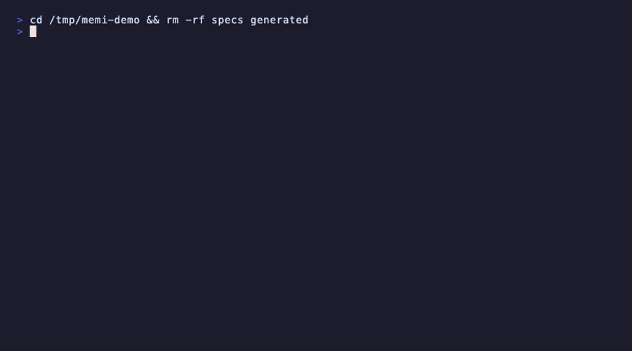

<p align="center">
  
</p>

<h1 align="center">memoire</h1>

<p align="center">
  <strong>Extract any website's design system. Generate production React components.</strong><br/>
  One command. No account. No Figma required.
</p>

<p align="center">
  <a href="https://www.npmjs.com/package/@sarveshsea/memoire"></a>
  <a href="https://github.com/sarveshsea/m-moire/actions/workflows/ci.yml"></a>
  
  
  <a href="https://github.com/sarveshsea/m-moire/blob/main/LICENSE"></a>
  <a href="https://glama.ai/mcp/servers/sarveshsea/m-moire"></a>
</p>

<p align="center">
  <a href="https://glama.ai/mcp/servers/sarveshsea/m-moire">
    
  </a>
</p>

---

## The shadcn pattern, for entire design systems

Every company has 2-3 Figma files that should be **the** design system. Nobody made them distributable. Until now.

```bash
# Publish your Figma file to npm in one command
npx @sarveshsea/memoire publish --name @you/ds --figma https://figma.com/design/xxx --push

# From any project, drop working code in
npx @sarveshsea/memoire add Button --from @you/ds
# → src/components/memoire/Button.tsx (real working code, not a spec)

# Jump to the component's page on the Marketplace
memi view Button
# → opens https://memoire.cv/components/@you/ds/Button

# When Figma changes, open a PR automatically
memi sync --auto-pr
```

A registry bundles tokens (W3C DTCG JSON + Tailwind v4 `@theme` CSS), component specs, and **real generated code** for React / Vue / Svelte. Publishable to npm, GitHub, or any static host. Every published registry is indexed on the [Memoire Marketplace](https://memoire.cv/components) within an hour of `npm publish`. See [`examples/starter-registry/`](./examples/starter-registry) to fork one.

### Designed in tweakcn? Publish with Memoire.

[tweakcn](https://tweakcn.com) is the visual theme editor for shadcn/ui. Paint your theme there, ship it with Memoire:

```bash
# From a tweakcn CSS export
memi publish --name @you/theme --theme ./tweakcn-export.css --push

# Or straight from a tweakcn share URL
memi publish --name @you/theme --theme https://tweakcn.com/r/themes/xxx --push
```

The `--theme` flag parses both Tailwind v3 (`:root { --primary: ... }`) and v4 (`@theme { --color-primary: ... }`) exports, including `:root` + `.dark` multi-mode themes.

<p align="center">
  
</p>

---

## What you get

| Input | Output |
|-------|--------|
| Any public URL | `DESIGN.md` with full token inventory + Tailwind config |
| Figma file (REST or plugin) | Design tokens, components, styles |
| Penpot file | Same tokens, same pipeline |
| JSON specs | React + TypeScript + Tailwind components (shadcn/ui) |
| Generated components | Storybook stories + shadcn registry server |

```bash
npm i -g @sarveshsea/memoire

memi design-doc https://linear.app     # extract any site's design system
memi go                                 # figma -> tokens -> specs -> components -> preview
memi go --rest                          # same thing, no figma desktop needed
memi go --penpot                        # same thing, from penpot
memi tokens                             # export as CSS / Tailwind / JSON / Style Dictionary
```

---

## Install without npm (work laptops, locked-down environments)

No Node, no npm, no admin rights.

```bash
# macOS / Linux — auto-patches your shell profile, verifies SHA256
curl -fsSL https://memoire.cv/install.sh | sh

# Windows (PowerShell) — auto-adds to user PATH
irm https://memoire.cv/install.ps1 | iex

# Homebrew (macOS / Linux)
brew install sarveshsea/memoire/memoire

# Docker (air-gapped envs where only ghcr.io is reachable)
docker run --rm -it -v "$PWD:/work" -w /work ghcr.io/sarveshsea/memoire --help

# Self-update once installed
memi upgrade
```

**Manual download** if `curl`, `brew`, and `docker` are all blocked — grab the archive from [GitHub Releases](https://github.com/sarveshsea/m-moire/releases/latest):

| Platform                | Archive                          |
|-------------------------|----------------------------------|
| macOS (Apple Silicon)   | `memi-darwin-arm64.tar.gz`       |
| macOS (Intel)           | `memi-darwin-x64.tar.gz`         |
| Linux (x86_64)          | `memi-linux-x64.tar.gz`          |
| Windows (x64)           | `memi-win-x64.zip`               |

Verify with `SHA256SUMS.txt` (attached to every release). Extract, add `memi` to PATH, run `memi connect`. The `skills/`, `notes/`, `plugin/`, `preview/` directories must stay next to the binary — Mémoire loads them at runtime.

---

## Use with Claude Code / Cursor

Memoire is an MCP server with 21 tools. Give your AI assistant direct access to your design system.

```bash
memi mcp config --install              # writes .mcp.json, done
```

Or add manually to `.mcp.json`:

```json
{
  "mcpServers": {
    "memoire": {
      "command": "memi",
      "args": ["mcp", "start"]
    }
  }
}
```

**Tools include:** `pull_design_system`, `generate_code`, `create_spec`, `get_tokens`, `compose`, `design_doc`, `run_audit`, `capture_screenshot`, `analyze_design`, and [11 more](https://memoire.cv/docs).

---

## Full command reference

<details>
<summary><strong>Core workflow</strong></summary>

| Command | What it does |
|---------|-------------|
| `memi setup` | Full onboarding: token, file, plugin, bridge, MCP config, test pull |
| `memi init` | Initialize workspace with starter specs |
| `memi connect` | Start Figma bridge (auto-discovers plugin on ports 9223-9232) |
| `memi pull` | Extract tokens, components, styles from Figma |
| `memi pull --rest` | Pull via REST API -- no plugin, no Figma Desktop |
| `memi pull --penpot` | Pull from Penpot (needs `PENPOT_TOKEN` + `PENPOT_FILE_ID`) |
| `memi spec <type> <name>` | Create a component, page, or dataviz spec |
| `memi generate [name]` | Generate shadcn/ui code + Storybook stories from specs |
| `memi generate --no-stories` | Generate without Storybook stories |
| `memi preview` | Start preview gallery + shadcn registry server |
| `memi go` | Full pipeline in one command |
| `memi export` | Export generated code into your project |
| `memi tokens` | Export tokens as CSS / Tailwind / JSON / Style Dictionary (W3C DTCG) |
| `memi validate` | Validate all specs against schemas |

</details>

<details>
<summary><strong>Design extraction</strong></summary>

| Command | What it does |
|---------|-------------|
| `memi design-doc <url>` | Extract design system from any URL into DESIGN.md |
| `memi design-doc <url> --spec` | Also write a DesignSpec JSON for codegen |
| `memi extract <url>` | Alias for design-doc |

</details>

<details>
<summary><strong>Sync, agents, research</strong></summary>

| Command | What it does |
|---------|-------------|
| `memi sync` | Full sync: Figma + specs + code |
| `memi sync --live` | Watch and sync continuously |
| `memi compose "<intent>"` | Agent orchestrator: classify, plan, execute |
| `memi agent spawn <role>` | Spawn a persistent agent worker |
| `memi research from-file <path>` | Process Excel/CSV into research |
| `memi research synthesize` | Synthesize themes and personas |
| `memi daemon start` | Start daemon with reactive pipeline |

</details>

<details>
<summary><strong>Diagnostics</strong></summary>

| Command | What it does |
|---------|-------------|
| `memi status` | Project status overview |
| `memi doctor` | Health check: project, plugin, bridge |
| `memi dashboard` | Launch monitoring dashboard |
| `memi audit` | Design system audit (WCAG, unused specs) |

All commands support `--json` for structured output.

</details>

---

## Spec-first workflow

Every component starts as a JSON spec before code is generated:

```json
{
  "name": "MetricCard",
  "type": "component",
  "level": "molecule",
  "shadcnBase": ["Card", "Badge"],
  "props": { "title": "string", "value": "string", "trend": "string?" },
  "variants": ["default", "compact"]
}
```

Specs are validated with Zod schemas. Components follow Atomic Design (atom, molecule, organism, template, page).

---

## Architecture

```
src/
  engine/     Core orchestrator, registry, sync, pipeline
  figma/      WebSocket bridge + REST client + Penpot client
  agents/     Intent classifier, plan builder, task queue
  mcp/        MCP server (21 tools, 3 resources, stdio)
  codegen/    shadcn/ui mapper, Storybook, dataviz, pages
  research/   Research engine (Excel, stickies, web)
  specs/      Spec types, Zod schemas, 62-component catalog
  preview/    Preview gallery, API server, shadcn registry
  notes/      Downloadable skill packs
  commands/   28 CLI commands
  plugin/     Figma plugin (Widget V2)
```

---

## Links

[memoire.cv](https://memoire.cv) -- [Changelog](CHANGELOG.md) -- [MCP docs](https://memoire.cv/docs) -- [Notes](https://memoire.cv/notes)

## License

MIT
